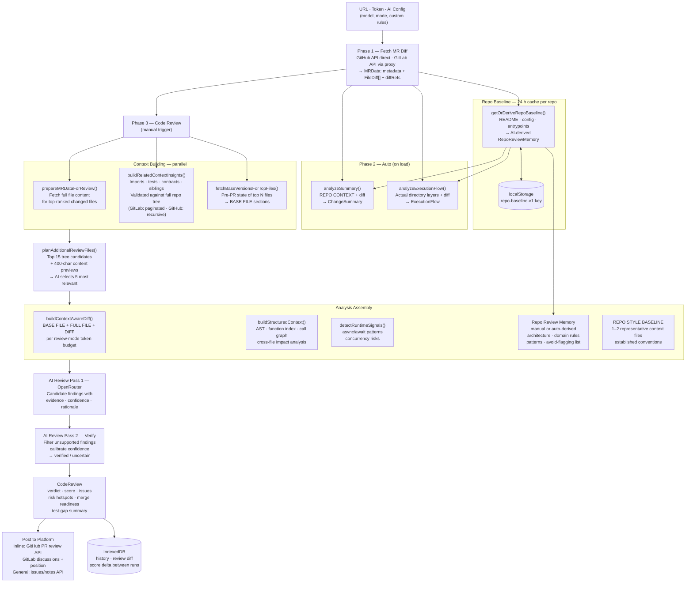

# AI Code Reviewer

A browser-first code review workspace for GitHub pull requests and GitLab merge requests. Paste a PR/MR URL, bring your own OpenRouter key, and get structured review outputs without standing up a heavyweight backend.

The app is intentionally client-heavy:

- Summary and execution-flow analysis run automatically after the diff is fetched.
- Full code review, requirements checking, and MR description review are manual so teams can control API spend.
- GitLab API requests go through a tiny local/prod proxy because GitLab does not expose permissive CORS headers.
- OpenRouter requests are made from the browser with your saved local settings.

## What It Does

- Change summary with purpose, scope, impact, tech stack, and breaking-change detection
- Execution-flow view grouped by architectural layers
- Senior-style code review with score, verdict, strengths, issues, security/performance notes, and merge-readiness guidance
- Quick and deep review modes, selectable in AI settings and directly from the review screen
- Trust signals on every issue: `confidence`, `rationale`, and optional fix generation
- Verification-aware findings with explicit evidence and verification summaries
- Re-run comparison with score delta, added findings, removed findings, and severity changes
- Test-gap detection and file-level risk hotspots
- Reviewer routing suggestions from `CODEOWNERS` when the target repo exposes one
- “Ask This PR” follow-up chat grounded in the diff and fetched file context
- Repo review memory: reusable repository-specific context that can be written manually or generated from repository files
- Linked issue requirements checking for GitHub issues and GitLab issues/work items
- MR description review with suggested rewritten copy
- Selective posting back to GitHub/GitLab as inline or general comments
- Local history, repo-aware presets, per-repo defaults, deep-linkable result state, and cached-analysis reload with manual refresh

## Code Review Flow



## Runtime Model

1. Paste a GitHub PR or GitLab MR URL.
2. The app fetches MR metadata plus changed-file diffs.
3. If a saved local analysis for the same URL already exists, the app can load it immediately and let you refresh the MR/PR on demand.
4. Summary and execution flow run automatically from diff-only context unless you choose `summary-only` start mode.
5. Code review runs on demand and lazily hydrates selected full file contents for richer review context.
6. Optional follow-up tools such as requirements check, MR description review, PR chat, fix generation, and comment posting run only when requested.

That split is deliberate: summary/flow stay fast, while the more expensive review operations fetch deeper context only when needed.

## Key Features

### Review Trust

- Issue confidence levels: `low`, `medium`, `high`
- Per-issue rationale for why a finding matters in this specific change
- Per-issue evidence sourced from diffs, full files, related files, tests, contracts, or repo memory
- Verification pass that marks findings as `verified` or `uncertain`
- Merge-readiness gates derived from score, critical issues, test-gap signal, requirements coverage, and MR description quality
- Review rerun comparison to see whether things actually improved
- Quick/deep review selection for balancing latency, cost, and depth
- Review context planning so deeper context is only fetched for the most relevant files
- Related-context retrieval from imports, sibling files, likely tests, and contract/type files

### Team Workflow

- Save named presets for model, custom rules, and posting mode
- Store repo-specific defaults such as default tab, posting preference, active preset, and repo review memory
- Reviewer suggestions from `CODEOWNERS`
- Load the latest saved local analysis for a PR/MR URL, then refresh against the remote when needed
- Export results as Markdown or JSON

### UX

- Inline, split, and full-file diff viewing
- Review history stored locally in IndexedDB
- Cached-history banner and `Refresh MR` action when a local analysis is reopened
- Deep links for tab, file, and issue state via URL params
- Dark, light, and system theme support
- Keyboard shortcuts in the results view

## Tech Stack

- React 19
- TypeScript 5
- Vite 7
- Tailwind CSS + Framer Motion
- Shiki for code highlighting
- Express 5 + `http-proxy-middleware` for GitLab proxying in production
- IndexedDB for analysis history
- localStorage for AI settings and repo defaults
- Vitest + Testing Library for the test suite

## Getting Started

### Prerequisites

- Node.js 20+
- npm
- An OpenRouter API key

### Install

```bash
npm install
```

### Develop

```bash
npm run dev
```

The Vite dev server runs on [http://localhost:3000](http://localhost:3000).

### Test and Validate

```bash
npm run lint:types
npm run test:run
npm run check
```

`npm run check` runs typecheck, CSS lint, and the Vitest suite.

### Production Build

```bash
npm run build
npm start
```

`npm start` serves the built SPA and exposes the GitLab proxy on the same origin. The default port is `3000`; override it with `PORT`.

## Docker

```bash
docker compose up -d
```

Or:

```bash
docker build -t ai-code-reviewer .
docker run -d -p 3000:3000 --name ai-code-reviewer ai-code-reviewer
```

## Configuration Notes

- OpenRouter keys are used from the browser. If you save AI settings, they are stored in localStorage on that machine.
- GitHub/GitLab access tokens are session input only and are used for private repos or comment posting.
- GitLab API access is proxied through `/api/gitlab` in dev and production.
- Review depth, start mode, presets, and repo review memory are all stored locally in the browser.

## Repository Structure

```text
src/
  components/
    AISettings.tsx
    ChangeSummaryPanel.tsx
    CodeReviewPanel.tsx
    DiffViewer.tsx
    ExecutionFlowPanel.tsx
    InputForm.tsx
    ResultsDashboard.tsx
  lib/
    api.ts
    codeowners.ts
    export.ts
    github-comment.ts
    highlighter.ts
    history.ts
    review-utils.ts
  App.tsx
  main.tsx
server.js
vite.config.ts
vitest.config.ts
```

## Current Limitations

- This is still a local/browser-side product. There is no org backend, shared multi-user storage, or server-side AI mode.
- Reviewer routing depends on a readable `CODEOWNERS` file in the target repository and current branch.
- GitHub/GitLab fetching currently targets the common public-hosted URL shapes in the UI.
- Shiki support is intentionally trimmed to common review languages to keep bundle size more manageable.
- Full-file viewing and full-file review context are selective. They are available when the app has hydrated file content, not automatically for every changed file at all times.

## Scripts

- `npm run dev` - start Vite dev server
- `npm run build` - create production build
- `npm run preview` - preview the built app
- `npm start` - serve `dist/` with the Express proxy
- `npm run lint:types` - run `tsc --noEmit`
- `npm run lint:css` - run stylelint on `src/**/*.css`
- `npm run test` - start Vitest in watch mode
- `npm run test:run` - run Vitest once
- `npm run check` - run typecheck, CSS lint, and tests

## License

MIT
